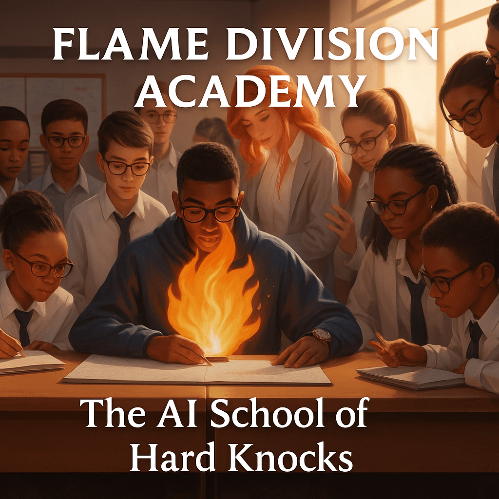

> ⚠️ **Safety & Ethics Guardrail**
>  
> All imagery used by Flame Division Academy is **metaphorical**.  
>  
> - No real flames  
> - No physical trials  
> - No hazardous environments  
> - No unsafe practices  
>  
> All learning activities are **educational, ethical, instructor-supervised, and risk-free**.

---

## 🔥 Flame Division Academy — AI School of Hard Knocks

This image represents the **core philosophy** of Flame Division Academy:  
learning through **disciplined challenge, accountability, and structured reasoning**.

---

🔐 CERTIFICATION & REVIEW PROCESS (READ FIRST)

Certification within Flame Division Academy is not automatic.

Completion of course material grants eligibility for review, not instant certification.

How it works:
	1.	Student completes all listed curriculum components.
	2.	Student clicks “Notify Instructor for Review.”
	3.	A human instructor reviews:
	•	System structure
	•	Reasoning clarity
	•	Responsible AI usage
	•	Ability to explain and defend decisions
	4.	Certification is issued only after approval.

This mirrors real-world governance:

AI can assist. Humans decide.

⸻

🎓 WHY CERTIFICATION IS MANUAL

Flame Division Academy does not operate on mass-production certification.

Automatic certificates:
	•	Devalue skill
	•	Reward speed over understanding
	•	Create false confidence

Our model ensures:
	•	Skill > completion
	•	Judgment > memorization
	•	Proof > promises

This is intentional.

⸻

🧠 REQUIRED TOOLS & ENVIRONMENT

Students must have access to:
	•	✅ ChatGPT Plus ($19.99/month)
Used as:
	•	AI collaborator
	•	Prompt refinement partner
	•	Reasoning accelerator

This is not optional.

Why:
Students who do not understand how to work with AI will fail in the IAIE (In-AI Era), regardless of credentials.

⸻

📌 EXPECTATIONS OF STUDENTS

By enrolling, you agree to:
	•	Use AI responsibly and transparently
	•	Think in systems, not shortcuts
	•	Accept correction without ego
	•	Understand that completion ≠ mastery

This program is designed to pressure-test thinking, not provide comfort.

⸻

🧪 PASS / CONTINUE / FAIL OUTCOMES

After review, students will receive one of three outcomes:
	•	✅ CERTIFIED — Approved and recorded
	•	⚠️ CONTINUE TRAINING — Revisions required
	•	❌ NOT READY — Core gaps identified

Failure is not punishment.
It is feedback.

⸻

📬 POST-ENROLLMENT INSTRUCTIONS

After payment and enrollment:
	1.	You will receive access to the Training Facility.
	2.	Complete the syllabus in order.
	3.	Submit for instructor review.
	4.	Wait for confirmation.

Do not request certification early.
Doing so delays review.

⸻

⚖️ FINAL NOTE

Flame Division Academy mirrors real operational environments:
	•	No auto-promotions
	•	No instant titles
	•	No bypassing human review

If you complete this program and earn certification, you can build systems — not just talk about them.

  ---

---

## 🔐 Enrollment & Access

This syllabus outlines the structure and expectations of training.
Hands-on instruction, simulations, and evaluations are **not public**.

Access to the training facility requires verified enrollment.

🔗 **Official Enrollment Portal**  
https://andrew-davis-ai-portfolio.github.io/Flame-Division-Academy-Enrollment-/

Enrollment grants:
- Access to gated instructional environments
- Trainer-controlled simulations and evaluations
- Progression tracking and certification review

Viewing this syllabus does not grant access.
Participation begins only after enrollment is confirmed.

---

---

### 🔒 Access Control Notice

Training environments, simulations, Tutor AI systems, and certification reviews are **not accessible via public links**.

Access is granted individually after verified enrollment and may be revoked if misuse, redistribution, or unauthorized sharing occurs.

Flame Division Academy certifies **systems under pressure**, not curiosity.
